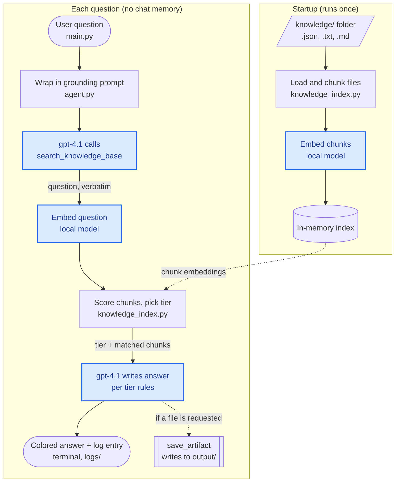

# KB Agent — Private Knowledge Base Assistant

A terminal assistant that answers questions strictly from your own documents, and says how confident it is.

## Contents

- **[Setup and Run](#setup-and-run)**
  - [The .env File](#the-env-file)
  - [Project Layout](#project-layout)
- [1. Problem Definition](#1-problem-definition)
- [2. Solution Design](#2-solution-design)
  - [Architecture](#architecture) · [Components](#components) · [Retrieval and Tiering](#retrieval-and-tiering) · [Prompt Design](#prompt-design)
- [3. Testing Approach](#3-testing-approach)
  - [Sample Inputs](#sample-inputs) · [Verification](#verification) · [Revisions Driven by Testing](#revisions-driven-by-testing)
- [4. Documentation](#4-documentation)
  - [Summary of Approach](#summary-of-approach) · [Prompt Examples](#prompt-examples) · [How It Was Tested](#how-it-was-tested) · [Reflection](#reflection)
- [How AI Was Used](#how-ai-was-used)

## Setup and Run

**Requirements:** Python 3.10+ (developed and tested on 3.14.3, Windows 11), internet access, and an OpenAI-compatible API key with access to `gpt-4.1`.

1. Open a terminal in the project folder (`Knowledge_Base_Application/`).
2. Create and activate a virtual environment:
   ```bash
   python -m venv .venv
   ```
   - Windows: `.venv\Scripts\activate`
   - macOS / Linux: `source .venv/bin/activate`
3. Install dependencies:
   ```bash
   pip install -r requirements.txt
   ```
4. Create a `.env` file in the project folder — see [The .env File](#the-env-file).
5. Start the app (`main.py` is the entry point):
   ```bash
   python main.py
   ```
   The first run downloads the embedding model (~440 MB) from Hugging Face and takes a few minutes; later runs load it from cache. Warnings about `HF_TOKEN` or symlinks are harmless.
6. Ask questions at the `>>>` prompt. Type `exit` or `quit` to leave.
7. *(Optional)* Control how much of the agent's reasoning appears in the terminal with `AGENT_LOG_LEVEL` in `constants.py`:
   - `LogLevel.OFF` — hides the agent's steps; answers only
   - `LogLevel.ERROR` — errors only
   - `LogLevel.INFO` — each step and tool call (default)
   - `LogLevel.DEBUG` — maximum detail

   Session logs in `logs/` are unaffected.

### The .env File

`agent.py` reads exactly these two variable names:

```
UDACITY_BASE_URL=https://openai.vocareum.com/v1
UDACITY_OPENAI_API_KEY=voc-xxxxxxxxxxxxxxxxxxxxxxxxxxxxxxxxxxxxx.xxxxxxxx
```

- With your own OpenAI key, set `UDACITY_BASE_URL=https://api.openai.com/v1`. Any OpenAI-compatible endpoint works if it serves `gpt-4.1` (set in `constants.py`). The `UDACITY_` prefix comes from my Udacity course environment; it works with any provider.
- **Please use your own API key.** If you don't have one, I can provide one privately. That key is strictly for reviewing this project: by using it, you agree not to share it with anyone or use it for any other purpose.

### Project Layout

| Path | Role |
|---|---|
| `main.py` | Entry point — run this |
| `knowledge/` | Knowledge base input. Add `.txt`, `.md`, or `.json` files; restart the app to re-index |
| `output/` | Artifacts the agent saves (summaries, reports) |
| `logs/` | One log file per session: index build, each search's tier and scores, each Q&A |
| `clean_logs_and_output.bat` | Windows: empties `logs/` and `output/`. macOS / Linux equivalent: `rm -f logs/* output/*` |
| `constants.py` | Tunables: thresholds, model IDs, terminal verbosity (`AGENT_LOG_LEVEL`, see step 7 above) |
| `.env` | **MUST-HAVE** API credentials (you create it) |

Knowledge file formats:
- `.json` — an array of objects, each with a `name` field; one chunk per object.
- `.txt` / `.md` — paragraphs separated by blank lines; one chunk per paragraph.

## 1. Problem Definition

### The Problem

Notes and internal docs get hard to search as they grow, and much of that knowledge is private — there is no public source to check an answer against. A general chatbot fills gaps with plausible guesses, which is the wrong behavior (hallucination).

KB Agent is a terminal app that answers questions **only from a local folder of `.txt`, `.md`, and `.json` files** — never from the LLM's own knowledge or the internet. Every answer states how well the files support it:

| Tier | When | Response | Answer prefix |
|---|---|---|---|
| `confident` | Strong match | Answers from the matched content | `<I_AM_CONFIDENT>` |
| `ambiguous` | Only weak matches | Answers, but warns it may be inaccurate | `<I_AM_NOT_VERY_SURE>` |
| `no_match` | Nothing relevant | Says the knowledge base has no information | `<I_HAVE_NO_INFO>` |

Files in `knowledge/` are indexed at program startup. Each question is answered independently (no chat memory).

### Use Cases

1. **Grounded Question & Answer** — ask about your own documents; get an answer with an honest confidence tier. Works for any domain: study notes, onboarding docs, product data.
2. **Grounded artifact generation** — ask for a summary or report; the agent saves it to `output/` (e.g. `.md`, `.txt`).

The bundled demo corpus describes a fictional company, Vantavo Technologies: pre-release products (JSON), a company overview (Markdown), and two competitor benchmarks (text).

## 2. Solution Design

### Architecture



**Blue areas are where AI plays a part.** The local embedding model (`multi-qa-mpnet-base-dot-v1`) handles retrieval at no API cost. `gpt-4.1` only calls the tool and writes the answer. Which chunks it sees, and which tier applies, is decided by threshold code — not the LLM.

### Components

| File | Responsibility |
|---|---|
| `main.py` | CLI loop: input, colored output, per-turn logging |
| `agent.py` | `ToolCallingAgent` on `gpt-4.1`; wraps each question in the grounding prompt |
| `agent_tools.py` | Agent tools: `search_knowledge_base`, `save_artifact` |
| `knowledge_index.py` | Chunking, local embeddings, scoring, tier assignment |
| `logger.py` | Per-session log file in `logs/` |
| `constants.py` | Thresholds, model IDs, folder paths |

### Retrieval and Tiering

- **Chunking:** one chunk per JSON object; one per paragraph for `.txt` / `.md`.
- **Scoring:** dot product of question and chunk embeddings. The model is trained for dot product (with vector magnitude counted in calculation), so scores are not bounded to 0–1 like any other normalized values.
- **Tiering:** chunks scoring ≥ 17.0 → `confident`; else ≥ 12.5 → `ambiguous`; else `no_match`. Each chunk qualifies on its own score, not its rank; at most 6 matches are returned.

### Prompt Design

Prompts live in two places:

1. **Docstring of `search_knowledge_base`** — smolagents puts it in the agent's context. Defines the per-tier response rules, and requires passing the question verbatim (no rephrasing) so retrieval stays deterministic.
2. **Prompt template in `agent.py`** — answer only from the knowledge base; call the search tool exactly once; prefix the tier label; call `save_artifact` on phrases like "write me a summary" or "save this as a doc" (`.md` for multi-section documents, `.txt` for short text).

Principle: anything that must be predictable — tier choice, which chunks the LLM sees — is decided in code. The LLM only phrases the answer based on the matched chunks fed to it.

## 3. Testing Approach

### Sample Inputs

Eight questions covering all three tiers, all three file types, and the artifact use case. Every answer must start with its tier's prefix.

| # | Input | Expected tier | Good output |
|---|---|---|---|
| 1 | What is the price of Northlight? | `confident` | Northlight's price only (JSON), though 6 chunks qualify |
| 2 | Who is the CEO of Vantavo, and when was the company founded? | `confident` | Renata Solis; 2016 (Markdown) |
| 3 | How much faster is SentriGuard Cloud than Wiz at fixing a misconfiguration? | `confident` | ~3 vs. ~45 minutes, keeping the "informal test" caveat (text) |
| 4 | Write me a summary of SentriGuard Cloud and save it as a doc | `confident` | `save_artifact` called; `.md` file in `output/`; knowledge-base facts only |
| 5 | Tell me something about Kubernetes | `ambiguous` | States no direct information; flags uncertainty; no Kubernetes facts |
| 6 | Does the company make any hardware products? | `ambiguous` | Hedged answer; flags uncertainty |
| 7 | What is the capital of France? | `no_match` | Refuses, even though the LLM knows the answer |
| 8 | Tell me something about dinosaurs and plants | `no_match` | Refuses; no invented facts |

### Verification

Run on 2026-09-30: all eight questions piped into `python main.py` (`gpt-4.1`). Tiers and scores taken from the session log.

| # | Tier (top score) | Observed answer | Result |
|---|---|---|---|
| 1 | `confident` (20.93) | "\$500/month platform fee, plus \$2 per fine-tuning compute-hour"; ignored the 5 other qualifying chunks | Pass |
| 2 | `confident` (31.40) | "Renata Solis, who co-founded the company in 2016" | Pass |
| 3 | `confident` (35.39) | ~3 vs. ~45 minutes to remediate; kept the informal-test caveat | Pass |
| 4 | `confident` (29.64) | Saved `output/sentriguard_cloud_summary.md`; every fact traceable to the corpus | Pass |
| 5 | `ambiguous` (14.38) | "No direct or clear information about Kubernetes"; named the loosely related content; flagged as possibly inaccurate | Pass |
| 6 | `ambiguous` (16.11) | "No explicit mention of hardware products"; flagged as possibly inaccurate | Pass, with finding |
| 7 | `no_match` | "The knowledge base has no relevant information for this question." | Pass |
| 8 | `no_match` | Same refusal | Pass |

All prefixes were correct. Each question used exactly one search call; #4 also called `save_artifact` once.

**Finding (#6):** Pulsewell is a wearable device. It scored 12.96 (above the `ambiguous` bar) but ranked 8th, so the 6-match cap (`MAX_RESULT_DEFAULT`) excluded it, and the answer concluded "software only". The uncertainty warning correctly signalled the answer was unreliable.

### Revisions Driven by Testing

- `confident` returned only the top chunk, so two-product comparisons missed the second product → **Revised**: refactored to return multiple matches rather than 1 best one.
- An unrelated product then appeared in a "Meridian" answer, despite a prompt rule to ignore irrelevant entries → **Revised**: chunks now qualify by their own score, not rank. The program will no longer pick from the top N best scores in the rank, it will instead pick the top scored matches that also surpass the criteria threshold. Filtering moved from prompt to code.
- Placeholder thresholds (0.55 / 0.25) assumed a 0–1 scale, which was a bug; real scores ran ~5–30, so every query — even gibberish — came back `confident` → **Revised**: recalibrated from measured scores (now 17.0 / 12.5). These 2 values are fine-tuned based on multiple rounds of testing.
- `ambiguous` originally asked the user to clarify → **Revised**: now answers with an explicit uncertainty warning.
- File saving triggered inconsistently → **Revised**: concrete trigger phrases added; agent step limit raised from 3 to 4.

## 4. Documentation

### Summary of Approach

A retrieval-augmented agent built with smolagents. At startup, knowledge files are chunked and embedded locally. For each question, `gpt-4.1` calls one search tool; plain code scores the chunks, picks a confidence tier, and returns only the qualifying chunks. The LLM answers from those chunks alone, following the rules for that tier, and can save the result as a file.

### Prompt Examples

**1. Search with the user's exact words** (`search_knowledge_base` docstring)
> IMPORTANT: pass the user's question exactly as they asked it. Do not rephrase, reword, shorten, or guess at what they "really" meant.

Why: a rephrased query changes which chunks match. Verbatim search keeps retrieval deterministic and reproducible.

**2. Answer weak matches, but flag them** (`search_knowledge_base` docstring)
> "ambiguous": … Still answer using ONLY this content, doing your best, but you MUST clearly flag to the user that this answer is uncertain and may be inaccurate …

Why: a weak match can still help, as long as the user knows not to rely on it.

**3. Make the tier visible** (`agent.py`)
> If the confidence tier is ambiguous, then you MUST also attach a `<I_AM_NOT_VERY_SURE>` label at the head of your answer.

Why: users see how much to trust each answer, and testing can check the tier directly from the output.

**4. Concrete triggers for saving files** (`agent.py`)
> … for example "write me a summary", "save this as a doc", "create a file with...", "give me a report I can keep", and etc., you MUST call the save_artifact tool to actually create that file.

Why: vaguer wording made file saving inconsistent; example phrases made it reliable.

### How It Was Tested

See [3. Testing Approach](#3-testing-approach): eight questions across all three tiers (in this ReadMe sampling), run live and checked against defined good output. Earlier test rounds during implementation (local tests performed around 40-50 times) drove the fixes under [Revisions Driven by Testing](#revisions-driven-by-testing).

### Reflection

**What worked well**
- I kept every decision that must be predictable — tier choice, which chunks the LLM sees — in code. The one time I relied on a prompt instruction to filter irrelevant chunks, it failed.
- Grounding held: the agent refused "What is the capital of France?" even though the model knows the answer.
- Three tiers instead of yes/no: weak matches still get an answer, with a warning. Test #6 shows that warning doing its job.
- Local embeddings make retrieval free; only answer generation uses the paid API.
- Every prompt and code fix came from a real test failure, not a guess.

**What I'd improve**
- **Chat memory:** make the agent stateful, so follow-ups like "what's its price?" work.
- **More sources:** support PDF, CSV, images, and web crawling.
- **Aggregation tools:** add tool functions for counting, aggregation, and similar questions; single-chunk retrieval can't answer "how many products are there?".
- **More validation:** every new file type needs its own testing round, and the thresholds and 6-match cap may need further tuning (see Finding #6).
- **Deployment:** move from a terminal app to a backend service so it can scale.

## How AI Was Used

- **Design:** I brainstormed options with Claude (e.g. local embeddings, a retrieval-tuned embedding model, deterministic confidence tiers, a stateless design); I made the final calls.
- **Code Implementation:** Claude assisted with Python coding and syntax under my detailed direction. I owned the original idea, the architecture of dataflow, and the design decisions in every step, and carefully audited every line of the code.
- **Debugging, tuning, testing:** I performed multiple rounds of live testing and found every issue listed under [Revisions Driven by Testing](#revisions-driven-by-testing); I proposed returning multiple matches and selecting them by score rather than rank; initiated the threshold recalibration; wrote the answer-prefix labels; designed the logging system and their insertion points.
- **Knowledge corpus:** Claude generated the fictional Vantavo Technologies knowledge files to my specification (topics, structure, and deliberate test cases such as near-duplicate products).
- **Writing, documentation, paperwork:** Claude helped edit this README for clarity, grammar, and efficiency.
